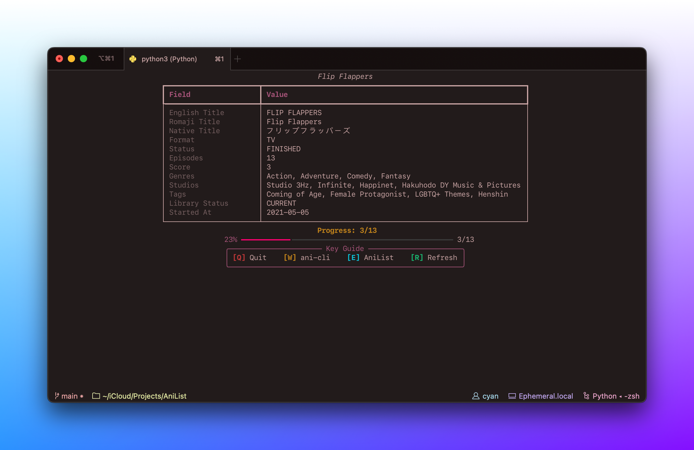

# 🔀 AniListRandomizer



AniListRandomizer is a Python script that fetches an AniList user's anime list, calculates weights based on their watch status and relationships, and randomly selects an anime to watch next. The script also provides detailed information about the selected anime and allows for interactive actions via keyboard commands.

## Features

- Fetches anime list from AniList using GraphQL.
- Calculates weights to prioritize ongoing and related completed anime.
- Displays detailed information about the selected anime in a formatted table.
- Provides a progress bar for ongoing or paused anime.
- Interactive key commands to quit, refresh, open the AniList page, or play the anime using [ani-cli](https://github.com/pystardust/ani-cli).

## Requirements

- Python 3.6+
- `requests` library
- `rich` library
- `ani-cli` (for the play anime feature)

You can install `ani-cli` from [pystardust/ani-cli](https://github.com/pystardust/ani-cli).

You can install the required Python libraries using:

```sh
pip install -r requirements.txt
```
